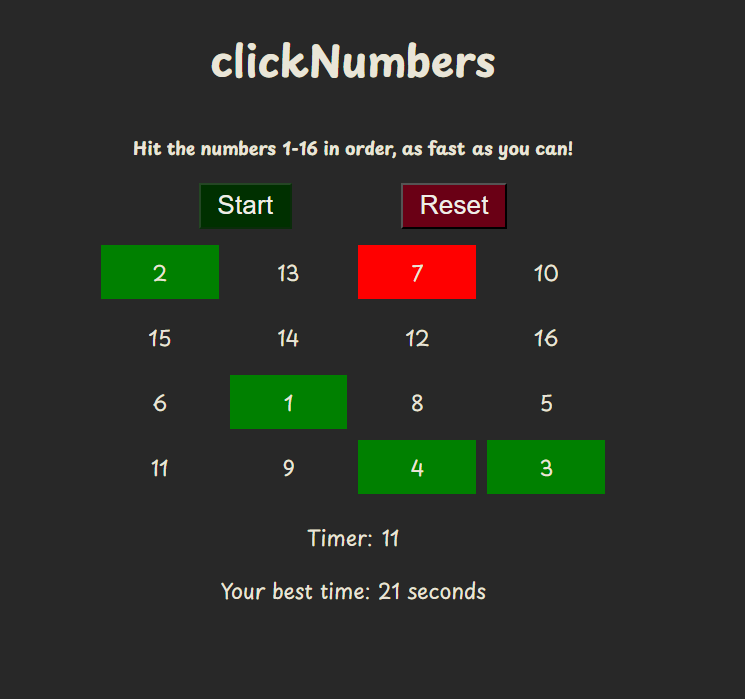

# clickNumbers

## Introduction

[clickNumbers](https://hogbergmarkus.github.io/click-numbers/)
is a website aimed at people that want some light entertainment,

while also getting exercise for their mind and a chance to compete against themselves.

The game provided is easy to understand, it is fun, and can also form a small

amount of addiction as you are trying to beat your best time.

## Table of contents

- [clickNumbers](#clicknumbers)
  - [Introduction](#introduction)
  - [Table of contents](#table-of-contents)
  - [Website owner and user goals](#website-owner-and-user-goals)
    - [Goals of the website owner](#goals-of-the-website-owner)
    - [Goals of the user](#goals-of-the-user)
  - [Website owner and user stories](#website-owner-and-user-stories)
    - [Website owner story](#website-owner-story)
    - [User story](#user-story)
  - [Design](#design)
    - [Wireframes](#wireframes)
    - [Fonts](#fonts)
    - [Colors](#colors)
  - [Screenshot of finished website](#screenshot-of-finished-website)
  - [Features](#features)
    - [Start button](#start-button)
    - [Reset button](#reset-button)
    - [Cursor](#cursor)
    - [Game numbers](#game-numbers)
    - [Timer](#timer)
    - [Best time](#best-time)
  - [Features to add](#features-to-add)
  - [Deployment](#deployment)
  - [Languages](#languages)
  - [Technologies used](#technologies-used)
  - [Testing](#testing)
    - [Validation](#validation)
    - [Lighthouse report](#lighthouse-report)
    - [Responsiveness](#responsiveness)
    - [Manual testing](#manual-testing)
      - [Start button](#start-button-1)
      - [Reset button](#reset-button-1)
      - [Game numbers](#game-numbers-1)
      - [Timer](#timer-1)
      - [Your best time](#your-best-time)
  - [Bugs](#bugs)
    - [Bug 1](#bug-1)
    - [Bug 2](#bug-2)
    - [Bug 3](#bug-3)
  - [Fixed Bugs](#fixed-bugs)
    - [Bug 1](#bug-1-1)
    - [Bug 2](#bug-2-1)
    - [Bug 3](#bug-3-1)
  - [Unfixed bugs](#unfixed-bugs)

## Website owner and user goals

### Goals of the website owner

1. The goal is to attract people to the website using a fun and interactive game.
2. The owner wants people to stay on the website.
3. People should come back to play more games.

### Goals of the user

1. The user wants an easily accessible game to play on a device of their choosing.
2. The game should provide some challenge so it does not get boring.
3. It has to be simple to pick up and play whenever they want to kill some time.

## Website owner and user stories

### Website owner story

For the owner it is important that people want to stay on the website, as well

as that the users come back to play more games.

Using a timer or other similar game element, should provide a competitive touch

that will help achieve those goals.

With enough traffic and retention on the website, add revenue would be possible.

### User story

The user is looking for something to pass time, and that something should also

provide a challenge. It has to be fast and easy to pick up and play wherever they are.

If the game lets them compete against themselves they are sure to come back for more.

## Design

### Wireframes

Here you will find the link to my wireframes from the design phase:

[Wireframes](https://github.com/hogbergmarkus/click-numbers/tree/main/documentation/wireframes)

### Fonts

1. Playpen Sans was chosen as the main font. I liked it for its playful looks,

    and felt it was well suited to give a joyful style to the pages otherwise
    simple styling.

2. Lato was chosen as a backup, because of its wide compatibility, readability,
    and modern style.

### Colors

I chose to keep the colors muted an simple, because I didnt want to distract the

player, while they try to find the correct numbers.

Also, the gray background with white text reminds me of sitting in my IDE,
which I quite enjoy.

The added colors of red and green to the buttons provide instant context which button
does what.

For the clicked numbers, the red and green should provide instant response if you
clicked right or wrong.

## Screenshot of finished website

## Features

### Start button

- The start button has to be pressed for game to start, otherwise an alert will tell

    you that no game is running, please press start.

- Button has a hover effect
- When the game is completed, or you hit Game Over, button is disabled to stop players
  
  from just starting from where game over was hit, or starting game without resetting the board.
  
- Starts the game and the timer.
  
### Reset button

- Reset button has a hover effect.
- The button has multiple functions build into itself:
  
1. It resets the board, filling the divs with new randomly placed numbers.
2. It resets the colors of the divs, wich were colored by clicks in previous game.
3. It resets the timer to 0.
4. It stops the game, so start has to be pressed again to play a new game.
5. It also resets the order of which numbers are to be clicked.

- At the en of the game, or game over, Reset has to be pressed before a new game can start.

### Cursor

The cursor will change shape when hovered above the clickable numbers.

### Game numbers

- The numbers placement is randomized, and will change position each game.
- When clicked in correct order, background will color green.
- When clicked incorrectly, background will color red.
- If clicked wile no game is running, an alert will prompt you to start a game.

### Timer

- Timer will start when game starts.
- It stops when game is completed or game over.
- Resets when reset button us pressed.

### Best time

The first game completed will be logged to the screen, so the coming attempts will

have something to be compared to.

The best time feature will look at the time on the timer when game is completed,

and if you beat your previous time, it will log your new best time to the screen.

## Features to add

- The game when fully developed, would have multiple difficulty levels.

    Each harder level would have an increased amount of numbers to click through.

- For the hardest setting, the colors could be removed from numbers that are clicked,

    that way it would be harder to keep track of numbers already clicked.

    It would also be harder to find the numbers you are looking for, since there would

    be no visual cues.

- There could be a login, to be able to save your score.

- Sounds can be added.

- There can be an option to change the numbers for colors instead.

## Deployment

I deployed the website to GitHub Pages using the following steps:

1. From my [Github](https://github.com/hogbergmarkus/click-numbers) repository for the project.
2. Click the settings icon in the top navigation menu.
3. In the lefthand side menu, click Pages.
4. Choose deploy from branch.
5. Select "main" and "/(root)".
6. Click Save.

After the build finished, the project is now accessible from the project repository.

On the righthand side is a tab called Deployments, click that and then you will

find a link to the deployed website under Active Deployments.

Here is a link to my deployed website: [clickNumbers](https://hogbergmarkus.github.io/click-numbers/)

## Languages

Languages used during this project:

1. JavaScript
2. HTML
3. CSS
4. Markdown

## Technologies used

- [CodeAnywhere](https://codeanywhere.com/solutions/collaborate), cloud based IDE.
- [Github](https://github.com/), for documentation and deployment.
- [Slack](https://slack.com/), for cummunication and community
- [Balsamiq](https://balsamiq.com/), for creating wireframes.
- [Google Fonts](https://fonts.google.com/), for text styling.
- [Google](https://www.google.com/), search tool.
- Chrome developer tools.

## Testing

### Validation

JavaScript was validated using [JSHint](https://jshint.com/)
with no errors or warnings.

HTML was validated using [W3C Markup Validation Service](https://validator.w3.org/#validate_by_input)
with no errors or warnings.

CSS was validated using [W3C CSS Validation Service (Jigsaw)](https://jigsaw.w3.org/css-validator/#validate_by_input)
with no errors or warnings

### Lighthouse report

The following lighthouse report was run on the finished deployed website:

### Responsiveness

The game was developed with a mobile first approach, but also works well on larger screens.

With the layout I have created, and how I have sized the elements using CSS,

There is currently no need for media queries.

During development I used These divices mainly for testing:

- Samsung Galaxy Fold
- Iphone 12 Pro
- iPad
- Used responsive screen sizing a lot as well

After deploying the project to GitHub Pages, I tested further on:

- Google Pixel 5
- Iphone 15 Pro
- iPad Pro
- Desktop computer

I tested the deployed webside in these web browsers:

- Google Chrome
- Safari
- Microsoft Edge

### Manual testing

Manual testing was conducted on:

- PC
- iPad Pro
- iPhone 15 Pro
- Google Pixel 5

Browsers used for testing was:

- Google Chrome
- Microsoft Edge
- Safari

#### Start button

- Highlights when mouse is hovered over.
- Starts game as expected.
- Starts timer.
- Button is disabled when game is completed.
- Button is disabled on game over.
- Button is enabled again after reset button is pressed.

#### Reset button

- Highlights when mouse is hovered over.
- Resets game as expected, so new game is able to start.
- Shuffles the game board of numbers.
- Resets the timer count.
- Resets the displayed time on the timer, on the website.
- Resets the number count, so the number clicked starts from 1 again.

#### Game numbers

- If no game is running, alert message will tell the user to start a game.
- Board is shuffled properly between games.
- When numbers are clicked correctly, div background colors green.
- When numbers are clicked incorrectly, div background colors red.
- When all numbers are clicked in correct order, game is complete, game stops, alert congratulates.

#### Timer

- Timer starts when game starts.
- Timer stops when game is complete or on game over.
- Timer is reset between games properly, both timer count and displayed time.

#### Your best time

- When first game is completed, that time will be displayed as Your best time.
- If you beat your previous time, that time will display properly as Your best time.

## Bugs

### Bug 1

When running my code through jshint, I got a warning saying

"Functions declared within loops referencing an outer scoped variable may lead

to confusing semantics. (timerRunning, div, firstNumber, secondsInterval, bestTime)"

### Bug 2

When running my code through jshint, I got a warning saying

"One undefined variable
142	numbers
145	numbers"

### Bug 3

During manual testing, using an iPad pro and Safari, I found that the timer could

be made to run abnormaly fast, and not reset when reset button was pressed.

On further testing, this was the case on more devices and browsers.

This happened when the Start button was pressed several times in a row.

## Fixed Bugs

### Bug 1

Bug has been patched.

I searched Slack, google and stack overflow for what the issue was exactly.

It did not cause any issues with my program, but getting rid of the warning seemed

appropriate.

I found the answer, which was to remove a loop from inside a function, and place it

outside the function instead.

### Bug 2

Bug has been patched. There was an undeclared variable, which is now declared.

### Bug 3

Bug has been patched. It was fixed by disabling the start button on game start.

## Unfixed bugs

There are currently no bugs unfixed that I am aware of.
